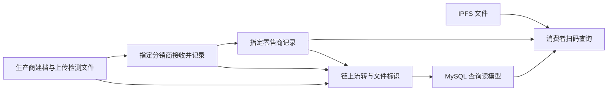

# 农产品溯源系统

农产品从生产、分销到零售，批次资料、交接记录和检测文件往往分散在不同环节。本项目把三方操作与消费者查询连接起来：参与方按批次记录流转，消费者通过溯源号或二维码查看公开信息及对应文件。

流转记录写入 FISCO BCOS 联盟链，文件存入 IPFS，账号、查询读模型和模拟环境数据保存在 MySQL；后端通过 WeBASE-Front 调用合约。

## 使用流程



## 它能做什么

- **按批次协作**：生产商建档并指定分销商，分销商再指定零售商；页面展示阶段、交接和更正记录。
- **查询来源**：消费者通过溯源号或二维码查看公开流转信息及绑定文件，业务账号只操作与自己有关的批次。
- **管理文件**：上传证书与报告，校验类型、大小及内容哈希；交易确认后文件才能绑定和公开读取。
- **处理异常**：交易结果未知时先查证，显示确认、失败或待核查状态；文件丢失时明确提示。
- **维护数据**：管理员管理账号、重建查询读模型，并按手册备份恢复数据库与文件；IoT 看板使用模拟数据。

## 工程取舍

| 问题 | 处理方式 | 可核查位置 |
| --- | --- | --- |
| 客户端地址不能证明调用者身份 | 服务端账号与 Bearer 会话确定身份，签名地址来自账号绑定；客户端地址头不参与身份判断 | [认证实现](back-me/src/main/java/com/qhx/back/service/impl/AuthServiceImpl.java) · [认证回归](back-me/src/test/java/com/qhx/back/auth/AuthIntegrationTest.java) |
| 仅靠后端限制交接可以被直接写链绕过 | v3 合约强制指定交接对象；旧 v2 批次保留原部署绑定，不把新保护追溯宣称为旧版本能力 | [合约说明](contracts/README.md) · [隔离链证据](docs/artifacts/README.md) |
| 超时后直接重发可能重复上链 | 发送前保存交易意图；未知结果通过回执或读链查证，再决定是否允许显式重提 | [交易生命周期](docs/tx-lifecycle.md) · [接口契约](docs/webase-front-contract.md) |
| 文件上传成功不等于已进入业务记录 | 流式上传、SHA-256 与 CID 读回校验；只在交易确认后绑定，未绑定文件按规则清理 | [文件机制](docs/files.md) · [文件测试](back-me/src/test/java/com/qhx/back/) |
| 批次列表逐条读链造成重复查询 | 分页读取数据库读模型，提供从链上重建与历史归属回填，保留数据来源区别 | [查询设计](docs/read-model.md) |
| 数据库恢复不能单独恢复完整业务 | 备份记录数据库、kubo 与链上标识的对应关系，恢复后核对批次、CID 与消费者视图 | [恢复手册](docs/backup-restore.md) · [原始记录](docs/artifacts/README.md) |

## 技术栈

| 层 | 实现 |
| --- | --- |
| 应用 | Spring Boot、MyBatis-Plus、Vue 2、Element UI |
| 链与文件 | FISCO BCOS、WeBASE-Front、Solidity、IPFS kubo |
| 数据与检查 | MySQL、Maven / JUnit、Hardhat、ESLint |

## 快速开始

先运行不连接链、MySQL 或 IPFS 的后端测试，检查本地构建环境。使用与 CI 相同的 JDK 21；编译目标为 Java 14，并非 JDK 8。依赖首次下载需要网络。

```bash
cd back-me
mvn -B test
cd ../front-me
npm ci
npm run lint
npm run build
```

前端沿用 Node 16 工具链。以上检查不启动完整业务系统；登录与流转需要 MySQL、WeBASE-Front 和文件服务。账号初始化、配置及隔离链搭建步骤见[运行参考](docs/reference.md#快速开始)，不要将无外部服务的单测视为整套应用已启动。

## 验证状态

截至代码提交 [`61a7d17`](https://github.com/asifours-blip/traceability-system/commit/61a7d17dcd5b2b72bd8ab9ffa2637d2b8848418f)，[CI 36456705657](https://github.com/asifours-blip/traceability-system/actions/runs/36456705657) 成功：执行后端默认测试、前端 lint、合约测试与 ABI 一致性检查。条件跳过的集成测试不算执行通过；前端构建是已有本地记录，尚未加入默认 CI。

[运行产物索引](docs/artifacts/README.md)将隔离链、MySQL、文件与恢复演练分开记录。v3 后端分流验证连接真实本地链与 WeBASE-Front，但使用 H2 和 FakeKubo；不能由此推出 v3 与真实 MySQL / IPFS 的完整业务联调已完成。

## 文档

| 文档 | 内容 |
| --- | --- |
| [架构](docs/architecture.md) | 链上、链下与应用的职责 |
| [业务流程](docs/business-flow.md) | 批次归属、交接、更正与公开字段 |
| [合约](contracts/README.md) | 版本、角色、阶段约束与迁移边界 |
| [交易生命周期](docs/tx-lifecycle.md) | 意图、回执、未知结果与查证 |
| [接口契约](docs/webase-front-contract.md) | 已核验的 WeBASE-Front 响应与错误 |
| [文件](docs/files.md) · [读模型](docs/read-model.md) | 上传绑定、公开读取、分页与重建 |
| [备份恢复](docs/backup-restore.md) | 数据库、文件与链上标识的恢复步骤 |
| [测试记录](docs/test_report.md) · [产物索引](docs/artifacts/README.md) | 分日期、环境查看通过、失败及跳过 |
| [运行参考](docs/reference.md) | 完整配置、初始化、命令、技术细节与历史验证 |
| [部署边界](docs/production-boundaries.md) | 身份、依赖与正式部署前的待办 |

## 局限

- 链上记录不能证明录入信息本身真实；IoT 数据为定时模拟值，尚未接入真实设备。
- 旧 v2 批次不具备 v3 的链上指定交接保护；历史多部署地址的自动路由尚未实现。
- 私钥托管在 WeBASE-Front，登录限流仅约束单个实例；密码找回、MFA 与跨实例限流未实现。
- 本地链和恢复演练不代表多机构联盟链或正式部署验收；依赖升级、完整 v3 存储联调等见[部署边界](docs/production-boundaries.md)。

## 仓库历史

项目起于农产品溯源毕业设计，保留原目录与包名。后续补充服务端身份、交易生命周期、文件校验与 v3 交接约束；初次完整导入不表示线上迭代周期。
