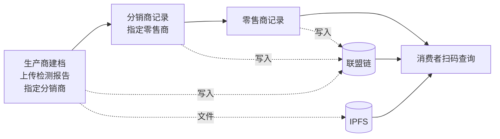

# 农产品溯源系统

一个基于联盟链的农产品溯源平台：生产商、分销商、零售商按批次记录各自环节，消费者扫码就能看到这批货从哪里来、经过了谁、有没有检测报告。

流转记录写在 FISCO BCOS 联盟链上，检测报告等文件存进 IPFS，账号和查询数据放在 MySQL。



## 从毕业设计到重新设计

这个项目最初是我的毕业设计。答辩之后回头审查时，我发现它的安全模型有几处根本性问题：

- 登录只检查"这个链上地址有没有角色"，不需要任何密码，知道别人的地址就能冒充对方；
- 注册接口不需要登录，任何人都能给自己授予生产商角色；
- 智能合约里存储溯源数据的条目合约，写入方法对所有人开放，绕过后端直接调用就能改写别人的记录。

于是我把信任模型整体重做了一遍，下面几个设计都来自这次重构。原合约的漏洞如实记录在[合约说明](contracts/README.md)里；我用同一套测试分别跑新旧两版合约，逐项对比，证明这些攻击在新合约上都会被拒绝。

## 几个值得一说的设计

**身份由服务端决定，链上权限只认合约。** 用户用账号密码登录，服务端签发令牌，发交易时的签名地址只能取自账号绑定的地址。合约这边，角色只能由管理员授予和撤销，条目合约只接受主合约写入，生产 → 分销 → 零售必须按顺序进行，每个阶段只能写一次。

**交接对象写在链上。** 生产商建档时就在链上指定下游分销商，只有被指定的分销商才能写分销环节。我在本地隔离链上实际测过：一个有分销商角色、但没被指定的账户，绕过后端直接调用合约，会被链拒绝（[运行记录](docs/artifacts/README.md)）。

**交易结果不确定时，不盲目重发。** 发交易之前先记下这次的意图；遇到超时，就通过交易回执或读链来确认它到底有没有上链，然后再决定是否允许重新提交。WeBASE-Front 在各种情况下的实际返回，都在真实链上逐条核对过（[接口契约](docs/webase-front-contract.md)）。

**文件要等上链成功才算数。** 检测报告以流式方式上传，服务端计算哈希并与 IPFS 返回的地址核对；只有等对应的交易确认之后，文件才会绑定到批次、对外公开。一直没被使用的文件会定期清理。

**查询不用每次都读链。** 列表和消费者查询读的是 MySQL 里的查询副本，这份副本随时可以从链上完整重建，重建过程是幂等的。

## 技术栈

Spring Boot · MyBatis-Plus · Vue 2 + Element UI · Solidity · FISCO BCOS + WeBASE-Front · IPFS（kubo） · MySQL · JUnit / Hardhat · GitHub Actions

## 本地运行

后端测试和前端构建不需要连接链、数据库或 IPFS（JDK 21、Node 16）：

```bash
cd back-me && mvn -B test
cd ../front-me && npm ci && npm run build
cd ../contracts && npm ci && npm test
```

完整运行需要 MySQL、WeBASE-Front 和 IPFS，部署步骤以及本地隔离链的搭建脚本见[运行参考](docs/reference.md)。

## 文档

- [系统架构](docs/architecture.md)、[业务流程](docs/business-flow.md)、[合约说明](contracts/README.md)
- [交易生命周期](docs/tx-lifecycle.md)、[文件机制](docs/files.md)、[查询读模型](docs/read-model.md)
- [备份恢复](docs/backup-restore.md)、[测试记录](docs/test_report.md)、[运行产物索引](docs/artifacts/README.md)
- [正式部署前的待办](docs/production-boundaries.md)

## 目前的边界

- 链上记录能保证数据写入后不被篡改，但不能保证录入的内容本身是真的。
- 旧版合约上已有的批次，仍然只有后端校验交接对象；IoT 看板使用的是模拟数据。
- 私钥托管在 WeBASE-Front 上；登录限流只在单个实例内生效。
- 所有验证都在本地隔离链上完成，没有在多机构的正式联盟链上部署过。
